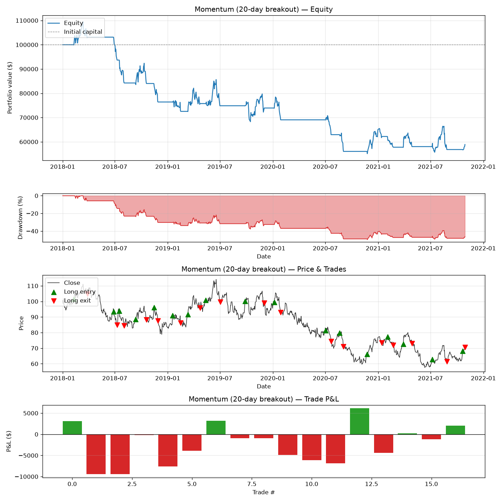
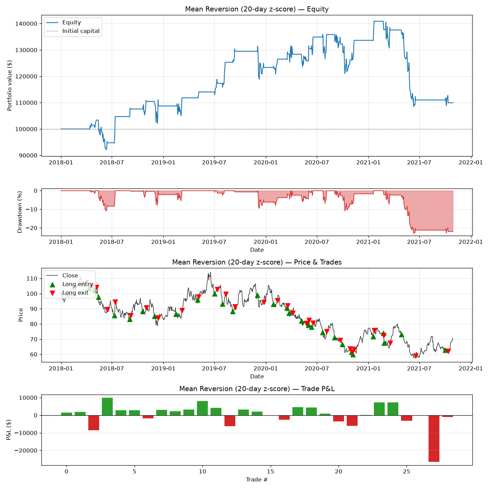

# backtester

A lightweight, event-driven backtesting framework for systematic trading strategies in Python. It walks forward through OHLCV price data bar-by-bar, executes trades implied by a strategy's signals with realistic transaction costs, and reports the standard performance metrics used to evaluate a systematic strategy.

- **Engine**: bar-by-bar simulation with commission + slippage, full portfolio bookkeeping (cash, position, equity curve, trade log)
- **Metrics**: cumulative/annualized return, Sharpe & Sortino ratios, max drawdown & duration, win rate, profit factor, trade return distribution
- **Strategies**: Donchian-channel momentum breakout, Bollinger/z-score mean reversion, plus a simple `Strategy` interface for writing your own
- **Validation**: rolling walk-forward optimization (in-sample parameter search → out-of-sample test) designed to prevent lookahead bias
- **Visualization**: equity curve + underwater (drawdown) plot, price chart with trade entry/exit markers, per-trade P&L



## Project structure

```
backtester/
├── src/backtester/          # the package
│   ├── data.py               # CSV / synthetic / (optional) yfinance data loading
│   ├── portfolio.py          # cash, position, equity curve, trade log
│   ├── engine.py             # BacktestEngine: runs a strategy over data
│   ├── metrics.py            # performance metrics
│   ├── validation.py         # walk-forward validation
│   ├── visualization.py      # matplotlib plotting helpers
│   └── strategies/
│       ├── base.py           # Strategy interface
│       ├── momentum.py       # N-period breakout strategy
│       └── mean_reversion.py # z-score / Bollinger Band strategy
├── tests/                    # pytest unit tests for every module above
├── data/sample_ohlcv.csv     # synthetic sample OHLCV data for examples/tests
├── examples/run_backtest.py  # example script: both strategies + walk-forward
├── notebooks/                # interactive exploration notebook
├── docs/images/               # sample output plots (see below)
└── scripts/generate_sample_data.py
```

## Setup

Requires Python 3.10+.

```bash
git clone https://github.com/<your-username>/backtester.git
cd backtester
python3 -m venv .venv
source .venv/bin/activate          # Windows: .venv\Scripts\activate
pip install -e ".[dev]"
```

This installs the package in editable mode plus `pytest` for running the test suite. Optional extras:

```bash
pip install -e ".[api]"     # yfinance, for pulling live OHLCV data
pip install -e ".[talib]"   # TA-Lib bindings (requires the TA-Lib C library installed separately)
```

Alternatively, install runtime dependencies only via `pip install -r requirements.txt`.

## Quickstart

```python
from backtester.data import load_csv
from backtester.engine import BacktestEngine
from backtester.strategies import MomentumStrategy

data = load_csv("data/sample_ohlcv.csv")

strategy = MomentumStrategy(lookback=20)
result = BacktestEngine(data, strategy, initial_capital=100_000,
                         commission_bps=5, slippage_bps=5).run()

print(result.summary())          # dict of performance metrics
result.equity_curve               # pd.Series
result.trade_log                  # pd.DataFrame of closed trades
```

Run the full example (both strategies + walk-forward validation, saves plots to `examples/output/`):

```bash
python examples/run_backtest.py
```

Or explore interactively:

```bash
jupyter notebook notebooks/strategy_exploration.ipynb
```

## How the engine prevents lookahead bias

Every `Strategy.generate_signals()` implementation computes a target position (`-1`/`0`/`1`) using only rolling windows over past and current bars. Before executing anything, `BacktestEngine` shifts the entire signal series forward by one bar (`signals.shift(1)`), so a decision computed from bar `t`'s close is only ever acted on at bar `t+1`. `walk_forward_validation` goes a step further: each window's parameter search and out-of-sample test are run on strictly non-overlapping, time-ordered data slices, so no information from a test window (or the future generally) can influence a decision made earlier.

## Transaction costs

The engine models two cost components, both configurable in basis points on `BacktestEngine`:

- **Commission** (`commission_bps`): charged on every trade's notional value.
- **Slippage** (`slippage_bps`): adverse price impact — buys/covers fill at a worse (higher) price, sells/shorts fill at a worse (lower) price.

Position sizing is "full allocation": entering a position commits all available cash (net of costs); exiting liquidates fully. This keeps the accounting simple while still exercising realistic cash/P&L bookkeeping.

## Writing your own strategy

```python
import pandas as pd
from backtester.strategies.base import Strategy

class MyStrategy(Strategy):
    def __init__(self, fast=10, slow=30):
        super().__init__(fast=fast, slow=slow)
        self.fast, self.slow = fast, slow

    def generate_signals(self, data: pd.DataFrame) -> pd.Series:
        fast_ma = data["close"].rolling(self.fast).mean()
        slow_ma = data["close"].rolling(self.slow).mean()
        return (fast_ma > slow_ma).astype(int)  # 1 = long, 0 = flat
```

Pass an instance to `BacktestEngine` exactly like the built-in strategies. Signals must only reference past/current bars — nothing else is required for the engine's lookahead protection to apply.

## Walk-forward validation

```python
from backtester.strategies import MomentumStrategy
from backtester.validation import walk_forward_validation

result = walk_forward_validation(
    data, MomentumStrategy,
    param_grid={"lookback": [10, 20, 30, 50]},
    train_size=180, test_size=60,
    optimize_metric="sharpe_ratio",
)

result.summary_table()             # per-window train vs. test metrics
result.aggregate_test_metrics()    # mean out-of-sample metrics across windows
result.combined_out_of_sample_equity()  # chained OOS equity curve
```

## Sample output

| Momentum (20-day breakout) | Mean reversion (20-day z-score) |
|---|---|
|  |  |

Both were run against the synthetic data in `data/sample_ohlcv.csv` with `commission_bps=5, slippage_bps=5`; regenerate them with `python examples/run_backtest.py`.

## Testing

```bash
pytest
```

The suite covers portfolio accounting, engine execution mechanics (including lookahead-bias regression tests), all performance metrics, both built-in strategies, and walk-forward validation.

## Data

`backtester.data` supports:

- `load_csv(path)` — any CSV with a date column and `open/high/low/close/volume` columns (case-insensitive)
- `generate_synthetic_ohlcv(...)` — geometric Brownian motion synthetic data, used for `data/sample_ohlcv.csv` and the test suite
- `load_yfinance(ticker, start, end)` — optional live-data wrapper around `yfinance` (`pip install -e ".[api]"`)

## License

[MIT](LICENSE)
